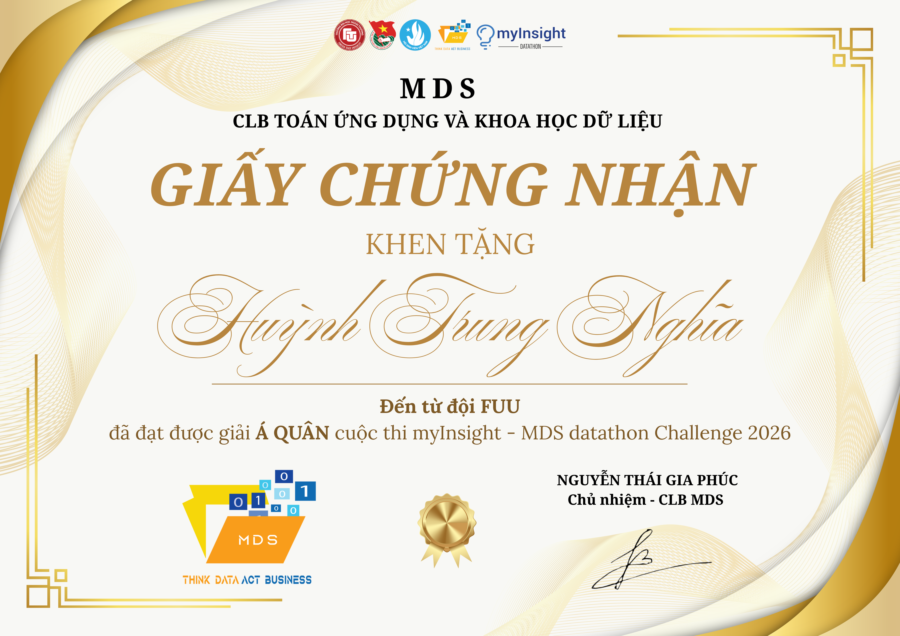
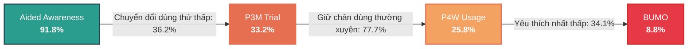
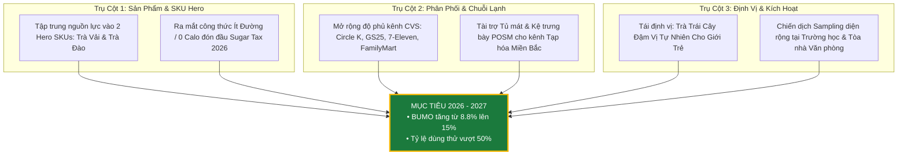

# 🏆 MDS DATATHON 2026 — FTU2
## Phân Tích Sức Khỏe Thương Hiệu & Chiến Lược Tăng Trưởng Cho Trà Cozy (RTD Tea Vietnam)

<div align="center">

[](https://github.com/solvarhuynh/MDS-Datathon-FTU2-2026)
[](https://github.com/solvarhuynh/MDS-Datathon-FTU2-2026)
[](deliverables/achievements/certificate_top5_mds2026.png)
[](#-thành-viên-đội-thi-fuu)
[](requirements.txt)
[](data/processed/cleaned_dataset.xlsx)

<br/>

[**📄 Slide Thuyết Trình Chung Kết (PDF)**](deliverables/slides/MDS_FUU_Final_Deck_V3.pdf) • [**📊 Dashboard Tương Tác (HTML)**](dashboards/brand_funnel_interactive.html) • [**📑 Báo Cáo Xử Lý Dữ Liệu (MD)**](docs/methodology.md)

</div>

---

## 👥 THÀNH VIÊN ĐỘI THI (FUU TEAM)

| STT | Họ và Tên | Vai Trò | Đơn Vị Đào Tạo | Thông Tin Kết Nối |
|:---:|:---|:---|:---|:---:|
| 1 | **Đặng Nguyễn Thu Hà** | **Nhóm trưởng (Team Leader)** | Trường ĐH Ngoại Thương Cơ sở II (FTU2) | [](https://www.linkedin.com/in/dangnguyenthuha/) |
| 2 | **Lê Chí Hoàng** | **Thành viên (Member)** | Trường ĐH Công nghệ Thông tin - ĐHQG-HCM (UIT) | [](https://github.com/solvarhuynh/MDS-Datathon-FTU2-2026) |
| 3 | **Huỳnh Trung Nghĩa** | **Thành viên (Member)** | Trường ĐH Công nghệ Kỹ thuật TP.HCM (HCMTUE) | [](https://github.com/solvarhuynh) |

---

## 📌 MỤC LỤC
1. [Tổng Quan Dự Án & Thành Tích](#1-tổng-quan-dự-án--thành-tích)
2. [Bối Cảnh Thị Trường & Bài Toán Kinh Doanh](#2-bối-cảnh-thị-trường--bài-toán-kinh-doanh)
3. [Những Phát Hiện Cốt Lõi (Key Insights)](#3-những-phát-hiện-cốt-lõi-key-insights)
4. [Chiến Lược Tăng Trưởng Đề Xuất](#4-chiến-lược-tăng-trưởng-đề-xuất)
5. [Cấu Trúc Thư Mục Kho Lưu Trữ](#5-cấu-trúc-thư-mục-kho-lưu-trữ)
6. [Phương Pháp Làm Sạch & Xử Lý Dữ Liệu](#6-phương-pháp-làm-sạch--xử-lý-dữ-liệu)
7. [Bảng Ánh Xạ Biểu Đồ & Mã Nguồn (Slide ↔ Chart ↔ Code)](#7-bảng-ánh-xạ-biểu-đồ--mã-nguồn)
8. [Hướng Dẫn Cài Đặt & Chạy Mã Nguồn](#8-hướng-dẫn-cài-đặt--chạy-mã-nguồn)
9. [Bản Quyền & Thông Tin Liên Hệ](#9-bản-quyền--thông-tin-liên-hệ)

---

## 1. TỔNG QUAN DỰ ÁN & THÀNH TÍCH

Dự án này là toàn bộ kho lưu trữ mã nguồn, dữ liệu, tài liệu phân tích thị trường và sản phẩm dự thi của **Đội thi FUU** tham gia cuộc thi **MDS Datathon 2026** do CLB Khoa học Dữ liệu MDS - Trường Đại học Ngoại Thương Cơ sở II (FTU2) tổ chức vào **Tháng 6/2026**.

- **Đề tài**: *Brand Health Tracking & Growth Acceleration for Cozy Ready-to-Drink (RTD) Tea in Vietnam Market (2024–2026)*.
- **Thành tích**: **TOP 5 ĐỘI THI XUẤT SẮC NHẤT TOÀN QUỐC (TOP 5 FINALIST)**.
- **Dữ liệu khảo sát**: Khảo sát thực tế diện rộng gồm **2.600 người tiêu dùng** (Wave 2024: n=1.300; Wave 2025: n=1.300) trên 1.068 biến số khảo sát chuyên sâu (nhận biết, dùng thử, tần suất, rào cản, hình tượng thương hiệu).

<br/>

<div align="center">
  
  <p><em>Chứng nhận Top 5 Chung cuộc MDS Datathon 2026 — Đội thi FUU</em></p>
</div>

---

## 2. BỐI CẢNH THỊ TRƯỜNG & BÀI TOÁN KINH DOANH

### 2.1 Bối Cảnh Ngành Hàng RTD Tea Việt Nam (2025–2026)
- **Quy mô thị trường**: Ngành hàng RTD Tea & Coffee Việt Nam đạt **913.6 triệu USD** (2025) và dự báo đạt **1.677 tỷ USD** vào năm 2033 (**CAGR 7.9%**). Trong đó, RTD Tea chiếm tỷ trọng áp đảo **73%**.
- **Thuế Tiêu Thụ Đặc Biệt Đồ Uống Có Đường (Sugar Tax)**: Có hiệu lực từ **1/1/2026** (áp thuế 10% từ 2026 và nâng lên 20% vào 2030), tạo áp lực trực tiếp lên giá thành các sản phẩm trà ngọt truyền thống.
- **Dịch chuyển tiêu dùng Healthy**: **82%** người tiêu dùng coi hàm lượng đường cao là rào cản mua nước giải khát, tạo thời cơ lớn cho dòng trà ít đường/thảo mộc tự nhiên.

### 2.2 Vấn Đề Cốt Lõi Của Trà Cozy
Cozy sở hữu độ nhận biết cao nhưng gặp tình trạng tắc nghẽn dòng chảy chuyển đổi người dùng (Brand Conversion Funnel):



- **Aided Awareness rất cao (91.8%)**: Gần như ngang ngửa C2 (97.2%), OLong Tea+ (98.8%), Không Độ (92.5%).
- **Tỷ lệ chuyển đổi sang Dùng thử (P3M Trial) kém**: Chỉ **36.2%** người biết Cozy dùng thử sản phẩm (C2: 67.9%, OLong Tea+: 67.6%).
- **Tỷ lệ BUMO (Brand Used Most Often) tụt dốc**: Cozy chỉ đạt **8.8%**, lép vế hoàn toàn trước C2 (32.1%) và OLong Tea+ (30.0%).

---

## 3. NHỮNG PHÁT HIỆN CỐT LÕI (KEY INSIGHTS)

1. **Rào Cản Vị Giác & Danh Mục (31.4% dồn)**:
   - **19.5%** người tiêu dùng không thích hương vị hiện tại của Cozy (độ chát, hậu vị, độ ngọt).
   - **11.9%** nhận xét danh mục sản phẩm của Cozy nghèo nàn, thiếu đa dạng biến thể (so với C2 có hơn 13 SKUs).
2. **Rào Cản Phân Phối & Chuỗi Lạnh (10.8% dồn)**:
   - **5.5%** không tìm thấy Cozy tại các điểm bán lẻ gần nhất.
   - **5.3%** phản ánh sản phẩm không được ướp lạnh trong tủ mát tại tiệm tạp hóa, đánh mất cơ hội bán hàng tức thì (impulse purchase).
3. **Mỏ Vàng Chưa Khai Thác Tại Thị Trường Miền Bắc**:
   - Miền Bắc có tới **870 người biết Cozy nhưng chưa dùng** — chiếm **51%** tổng dung lượng chuyển đổi tiềm năng toàn quốc.
   - Dư địa chuyển đổi tại miền Bắc cao hơn **+71%** so với khu vực Mekong.

---

## 4. CHIẾN LƯỢC TĂNG TRƯỞNG ĐỀ XUẤT

FUU đề xuất mô hình chiến lược 3 trụ cột (3 Pillars) tập trung giải quyết triệt để các rào cản gốc rễ:



---

## 5. CẤU TRÚC THƯ MỤC KHO LƯU TRỮ

```text
MDS-Datathon-FTU2-2026/
├── README.md                           # Hồ sơ dự án & tài liệu tổng quan
├── requirements.txt                    # Thư viện Python phụ thuộc
├── .gitignore                          # Cấu hình bỏ qua cache, file tạm
│
├── data/                               # Dữ liệu phục vụ phân tích
│   ├── processed/
│   │   └── cleaned_dataset.xlsx        # Dataset sạch (2.600 dòng x các biến chuẩn hóa)
│   └── raw/
│       └── raw_dataset.csv             # Dữ liệu khảo sát thô ban đầu (14.8 MB)
│
├── docs/                               # Tài liệu học thuật, nghiên cứu thị trường & kịch bản
│   ├── methodology.md                  # Quy chuẩn 9 bước tiền xử lý & phân tích Data gap
│   ├── market_research.md              # Báo cáo thị trường RTD Tea, Sugar Tax 2026, SWOT
│   ├── macro_micro_overview.docx       # Báo cáo môi trường Vĩ mô (PESTLE) & Vi mô (5 Forces)
│   ├── presentation_outline.xlsx       # Kịch bản thuyết trình, flow logic & checklist
│   ├── insight_hypotheses.xlsx         # Danh mục câu hỏi & giả thuyết cần kiểm chứng
│   └── v3_deck_chart_mapping.md        # Bảng đối sánh Slide - Chart - Code gốc
│
├── dashboards/                         # Bảng điều khiển tương tác trực quan (HTML/JS)
│   ├── brand_funnel_interactive.html   # Dashboard Dark-mode Chart.js phân tích Phễu & Rào cản Cozy
│   └── brand_funnel_slide_view.html    # Giao diện Slide Card View chuẩn trình chiếu
│
├── deliverables/                       # Sản phẩm đầu ra cuộc thi & chứng nhận
│   ├── slides/
│   │   ├── MDS_FUU_Final_Deck_V3.pdf       # Slide thuyết trình Vòng Chung kết (31 trang)
│   │   └── MDS_FUU_Preliminary_Deck_V2.pdf # Slide thuyết trình Vòng Sơ loại
│   └── achievements/
│       ├── certificate_top5_mds2026.png    # Chứng nhận Top 5 Chung cuộc MDS Datathon 2026
│       └── FTU_huynh_trung_nghia.jpg       # Ảnh thành viên Huỳnh Trung Nghĩa (FUU Team)
│
├── src/                                # Toàn bộ mã nguồn Python
│   ├── pipeline/
│   │   └── clean_data_pipeline.py      # Pipeline tự động hóa làm sạch dataset
│   └── charts/                         # 37 scripts sinh biểu đồ tương ứng với Slide Deck V3
│       ├── slide03_segmentation_matrix/    # Ma trận phân khúc & độ hấp dẫn thị trường
│       ├── slide05_consumer_profile/       # Chân dung người dùng & cơ hội Miền Bắc
│       ├── slide06_brand_funnel/           # Phễu chuyển đổi các thương hiệu
│       ├── slide07_root_cause_barriers/    # Phân cụm rào cản gốc rễ của Cozy
│       ├── slide08_image_void/             # Bản đồ khoảng trống hình tượng (Image Void Heatmap)
│       ├── slide08b_persona/               # Chân dung khách hàng mục tiêu & nhóm cần tái chiếm
│       ├── slide09_touchpoint/             # Điểm chạm truyền thông (Touchpoint Analysis)
│       ├── slide10_availability/           # Rào cản sẵn có tại điểm bán & độ phủ kênh
│       ├── slide11_sku_hero/               # Phân tích danh mục Hero SKU (Trà Vải vs Trà Đào)
│       ├── slide13_positioning/            # Ngôi nhà định vị thương hiệu (Brand House)
│       ├── slide15_roadmap/                # Lộ trình triển khai chiến lược 2026–2027
│       ├── slide16_value_chain_pillars/    # Ngân sách, sizing & 3 trụ cột chuỗi giá trị
│       ├── exploratory/                    # Các script phân tích mở rộng & thống kê mô tả
│       └── misc/                           # Biểu đồ bổ trợ
│
└── archives/                           # Lưu trữ an toàn các file nén nguyên bản
    ├── V2_VISUALIZATION_backup.zip
    ├── V3_Figures_Code_backup.zip
    └── V2_Barrier_Strategy_Solution_backup.zip
```

---

## 6. PHƯƠNG PHÁP LÀM SẠCH & XỬ LÝ DỮ LIỆU

Tài liệu chi tiết tại [`docs/methodology.md`](docs/methodology.md). Quy trình tiền xử lý được tự động hóa bằng [`src/pipeline/clean_data_pipeline.py`](src/pipeline/clean_data_pipeline.py) qua 9 bước nghiêm ngặt:

| Bước | Hạng Mục Xử Lý | Số Lượng Cột / Dòng Bị Ảnh Hưởng | Cơ Sở & Biện Pháp Kỹ Thuật |
|:---:|:---|:---:|:---|
| **1** | **Drop Cột 100% NULL** | 76 cột | Loại bỏ các thuộc tính không có dữ liệu (riêng `Q6 - Không Độ` ghi nhận là Data Gap). |
| **2** | **Drop Cột Zero-Variance** | 72 cột | Xóa bỏ các cột chỉ chứa 1 giá trị duy nhất (không có biến thiên thống kê). |
| **3** | **Xử Lý Cột Trùng Tên `.1`** | 15 cột | Hợp nhất và chuẩn hóa tên cột do lỗi export Excel tự thêm hậu tố `.1`. |
| **4** | **Chuẩn Hóa Chuỗi Ký Tự (Typo)** | Đa dạng cột | Đổi En dash (`–`) thành hyphen (`-`), sửa `Oolong` → `Olong`, chuẩn hóa khoảng trắng thừa. |
| **5** | **Đồng Bộ Nhóm Tuổi** | Toàn bộ mẫu (n=2.600) | Đồng bộ nhãn nhóm tuổi thành 5 phân nhóm chuẩn: `14 - 18`, `19 - 24`, `25 - 29`, `30 - 34`, `35 - 40 y.o.` |
| **6** | **Xử Lý Mâu Thuẫn Logic BUMO vs P4W** | 13 trường hợp | Nếu respondent chọn thương hiệu là BUMO nhưng P4W lại đánh dấu No, hiệu chỉnh logic về tính nhất quán. |
| **7** | **Mã Hóa Nhị Phân (Binary Encoding)** | Tất cả câu hỏi Yes/No | Chuyển đổi `"Yes"/"No"` sang `1/0` phục vụ tính toán đại số ma trận và mô hình. |
| **8** | **Mã Hóa Thứ Bậc Tần Suất (Ordinal)** | Các câu hỏi Q6 | Gán điểm trọng số tần suất sử dụng (từ Mỗi ngày = 7 lần/tuần đến Hiếm khi). |
| **9** | **Trọng Số Mẫu Theo Khu Vực (Weighting)** | Cột `Weight` | Cân bằng tỷ trọng dân số thực tế giữa 4 khu vực: Bắc, Trung, Đông Nam Bộ, Mekong. |

---

## 7. BẢNG ÁNH XẠ BIỂU ĐỒ & MÃ NGUỒN

Tất cả 37 biểu đồ trong Slide Deck Vòng Chung Kết [`deliverables/slides/MDS_FUU_Final_Deck_V3.pdf`](deliverables/slides/MDS_FUU_Final_Deck_V3.pdf) đều có thể tái tạo 100% bằng code Python:

| Trang Slide | Phân Khu Phân Tích | Tên File Ảnh Biểu Đồ | File Mã Nguồn Tương Ứng |
|:---:|:---|:---|:---|
| **Trang 5** | Ma Trận Phân Khúc | [`s3_segmatrix.png`](src/charts/slide03_segmentation_matrix/s3_segmatrix.png) | [`charts_slide3_matrix.py`](src/charts/slide03_segmentation_matrix/charts_slide3_matrix.py) |
| **Trang 7** | Chân Dung & Quy Mô | [`s5_cozy_reach_region.png`](src/charts/slide05_consumer_profile/s5_cozy_reach_region.png) | [`charts_slide5.py`](src/charts/slide05_consumer_profile/charts_slide5.py) |
| **Trang 7** | Phễu Thương Hiệu | [`s6_funnel.png`](src/charts/slide06_brand_funnel/s6_funnel.png) | [`charts_slide7.py`](src/charts/slide06_brand_funnel/charts_slide7.py) |
| **Trang 8** | Tỷ Lệ Chuyển Đổi | [`s6_conversion.png`](src/charts/slide06_brand_funnel/s6_conversion.png) | [`charts_slide7.py`](src/charts/slide06_brand_funnel/charts_slide7.py) |
| **Trang 8** | Đối Sánh Phễu | [`s6_funnel_compare.png`](src/charts/slide06_brand_funnel/s6_funnel_compare.png) | [`charts_slide7.py`](src/charts/slide06_brand_funnel/charts_slide7.py) |
| **Trang 9** | Rào Cản Chuyển Đổi | [`s7_barriers_cluster.png`](src/charts/slide07_root_cause_barriers/s7_barriers_cluster.png) | [`charts_slide7.py`](src/charts/slide07_root_cause_barriers/charts_slide7.py) |
| **Trang 10** | Khoảng Trống Hình Tượng | [`s8_attr_heatmap.png`](src/charts/slide08_image_void/s8_attr_heatmap.png) | [`charts_slide8.py`](src/charts/slide08_image_void/charts_slide8.py) |
| **Trang 10** | Dumbbell Thuộc Tính | [`s8_dumbbell.png`](src/charts/slide08_image_void/s8_dumbbell.png) | [`charts_slide8.py`](src/charts/slide08_image_void/charts_slide8.py) |
| **Trang 11** | Điểm Chạm & TOM | [`s9_tom.png`](src/charts/slide09_touchpoint/s9_tom.png), [`s9_touchpoint.png`](src/charts/slide09_touchpoint/s9_touchpoint.png) | [`charts_slide9.py`](src/charts/slide09_touchpoint/charts_slide9.py) |
| **Trang 12** | Sẵn Có & In-store | [`s10_barrier.png`](src/charts/slide10_availability/s10_barrier.png), [`s10_instore.png`](src/charts/slide10_availability/s10_instore.png) | [`charts_slide10.py`](src/charts/slide10_availability/charts_slide10.py) |
| **Trang 14** | Tăng Trưởng Nhóm Tuổi | [`s5_cozy_p4w_age_yoy.png`](src/charts/slide05_consumer_profile/s5_cozy_p4w_age_yoy.png) | [`charts_slide5.py`](src/charts/slide05_consumer_profile/charts_slide5.py) |
| **Trang 16** | Chân Dung Persona | [`s8b_persona.png`](src/charts/slide08b_persona/s8b_persona.png) | [`charts_slide8b.py`](src/charts/slide08b_persona/charts_slide8b.py) |
| **Trang 17** | Cơ Hội Miền Bắc | [`s5_scale_opportunity_north.png`](src/charts/slide05_consumer_profile/s5_scale_opportunity_north.png) | [`chart_scale_opportunity_north.py`](src/charts/slide05_consumer_profile/chart_scale_opportunity_north.py) |
| **Trang 19** | SKU Hero Trà Vải | [`sku_herovai.png`](src/charts/slide11_sku_hero/sku_herovai.png) | [`charts_sku_hero.py`](src/charts/slide11_sku_hero/charts_sku_hero.py) |
| **Trang 20** | SKU Hero Trà Đào | [`sku_dao.png`](src/charts/slide11_sku_hero/sku_dao.png) | [`charts_sku_hero.py`](src/charts/slide11_sku_hero/charts_sku_hero.py) |
| **Trang 22** | Brand House Định Vị | [`s13_house.png`](src/charts/slide13_positioning/s13_house.png) | [`charts_slide13.py`](src/charts/slide13_positioning/charts_slide13.py) |
| **Trang 24** | Lộ Trình Thực Thi | [`s15_roadmap.png`](src/charts/slide15_roadmap/s15_roadmap.png) | [`charts_slide15.py`](src/charts/slide15_roadmap/charts_slide15.py) |
| **Trang 29** | Ngân Sách & Sizing | [`s16_budget_v2.png`](src/charts/slide16_value_chain_pillars/s16_budget_v2.png), [`s16_sizing.png`](src/charts/slide16_value_chain_pillars/s16_sizing.png) | [`charts_slide16.py`](src/charts/slide16_value_chain_pillars/charts_slide16.py) |
| **Trang 31** | 3 Trụ Cột Chuỗi Giá Trị | [`s16_pillar1_product.png`](src/charts/slide16_value_chain_pillars/s16_pillar1_product.png) | [`charts_slide16.py`](src/charts/slide16_value_chain_pillars/charts_slide16.py) |

---

## 8. HƯỚNG DẪN CÀI ĐẶT & CHẠY MÃ NGUỒN

### 8.1 Yêu Cầu Môi Trường
- **Python**: Phiên bản `3.10` trở lên.
- **Hệ điều hành**: Windows, macOS, hoặc Linux.

### 8.2 Cài Đặt Thư Viện Phụ Thuộc
Khởi tạo môi trường ảo và cài đặt các thư viện cần thiết:

```bash
# 1. Khởi tạo môi trường ảo
python -m venv venv

# 2. Kích hoạt môi trường ảo
# Trên Windows PowerShell:
.\venv\Scripts\Activate.ps1
# Trên macOS / Linux:
# source venv/bin/activate

# 3. Cài đặt các gói thư viện
pip install -r requirements.txt
```

### 8.3 Chạy Pipeline Làm Sạch Dữ Liệu
Để thực thi pipeline làm sạch 9 bước từ dữ liệu thô sang `data/processed/cleaned_dataset.xlsx`:

```bash
python src/pipeline/clean_data_pipeline.py
```

### 8.4 Tái Tạo Biểu Đồ Bất Kỳ
Mỗi script tạo biểu đồ đều hoạt động độc lập và tự động liên kết với dữ liệu sạch:

```bash
# Sinh biểu đồ phân tích cơ hội Miền Bắc (Slide 17)
python src/charts/slide05_consumer_profile/chart_scale_opportunity_north.py

# Sinh biểu đồ phễu chuyển đổi thương hiệu (Slide 7 - 8)
python src/charts/slide06_brand_funnel/charts_slide7.py

# Sinh biểu đồ rào cản gốc rễ chuyển đổi (Slide 9)
python src/charts/slide07_root_cause_barriers/charts_slide7.py

# Sinh biểu đồ sản phẩm chủ lực SKU Hero (Slide 19 - 20)
python src/charts/slide11_sku_hero/charts_sku_hero.py
```

### 8.5 Trải Nghiệm Dashboard Trực Quan Hóa
Mở trực tiếp các tệp HTML trong trình duyệt web để tương tác với dữ liệu:
- **Interactive Dark-Mode Dashboard**: [`dashboards/brand_funnel_interactive.html`](dashboards/brand_funnel_interactive.html)
- **Slide Card View Dashboard**: [`dashboards/brand_funnel_slide_view.html`](dashboards/brand_funnel_slide_view.html)

---

## 9. BẢN QUYỀN & THÔNG TIN LIÊN HỆ

- **Đội ngũ thực hiện**: **Team FUU (MDS Datathon 2026)**
  - **Đặng Nguyễn Thu Hà** — Nhóm trưởng (FTU2) — [LinkedIn Profile](https://www.linkedin.com/in/dangnguyenthuha/)
  - **Lê Chí Hoàng** — Thành viên (UIT)
  - **Huỳnh Trung Nghĩa** — Thành viên (FTU2) — [GitHub Profile](https://github.com/solvarhuynh)
- **Đơn vị tổ chức cuộc thi**: CLB Khoa học Dữ liệu MDS — Trường Đại học Ngoại Thương Cơ sở II tại TP. Hồ Chí Minh (FTU2)
- **Mục đích chia sẻ**: Kho lưu trữ mở phục vụ mục đích học thuật, nghiên cứu phương pháp luận và tham khảo chuyên môn cho các kỳ thi Datathon & Marketing Analytics.
